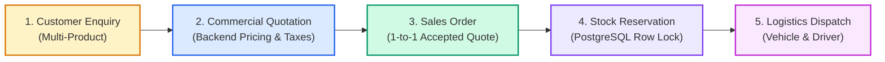

# Industrial Supply ERP System — PERN Stack (Round 2)

> A modern, full-stack industrial supply and operations ERP system implementing the complete commercial workflow:  
> **Customer Enquiry → Commercial Quotation → Sales Order Conversion → Concurrency-Safe Stock Reservation → Stock Dispatch**

---

## 🔗 Live Access Links & Evaluation Summary

| Service / Environment | Access Link | Description & Notes |
| :--- | :--- | :--- |
| 🌐 **Live Public Web Application** | [**https://fundsroom-erp-round2.loca.lt**](https://fundsroom-erp-round2.loca.lt) | **Instant live access** *(Tunnel Password / IP if prompted: `104.28.252.174`)* |
| 🌐 **Cloud Production (Vercel)** | [**https://fundsroom-erp-crm-five.vercel.app**](https://fundsroom-erp-crm-five.vercel.app) | Cloud-deployed frontend application on Vercel |
| 💻 **Local Web Application** | [`http://localhost:5173`](http://localhost:5173) | Vite + React frontend running locally |
| ⚙️ **Local REST API** | [`http://localhost:5000/api`](http://localhost:5000/api) | Express + Prisma REST API running locally |
| 📚 **Interactive Swagger API Docs** | [`http://localhost:5000/api-docs`](http://localhost:5000/api-docs) | OpenAPI interactive endpoints specification |
| 📄 **Full Technical Report** | [**`ROUND2_IMPLEMENTATION_REPORT.md`**](./round%202/ROUND2_IMPLEMENTATION_REPORT.md) | Detailed architecture, concurrency analysis, and test proofs |
| 📬 **Postman Collection** | [**`postman_collection.json`**](./round%202/postman_collection.json) | Importable Postman v2.1 collection with token scripts |

---

## 🔑 Pre-Seeded Test Login Credentials

| Role | Email Address | Password | Primary Capabilities |
| :--- | :--- | :--- | :--- |
| **Admin** | `admin@erp.com` | `admin123` | View all records, manage stock ledger, confirm sales orders (with row-level lock reservation), process vehicle dispatch |
| **Sales User** | `sales@erp.com` | `sales123` | Create customers, record multi-item product enquiries, generate commercial quotations, convert accepted quotes to Sales Orders |

> **Evaluator Tip:** The Login screen features **1-click Demo Admin and Demo Sales User buttons** for instant persona switching without manual typing.

---

## 🔄 End-to-End Business Workflow



1. **Enquiry**: Capture multi-product requirements with required fulfillment dates.
2. **Quotation**: Backend deterministically calculates line amounts, discounts, and GST.
3. **Conversion**: Only `ACCEPTED` quotations convert into Sales Orders; duplicate conversion is strictly blocked.
4. **Reservation**: Order confirmation uses **PostgreSQL Pessimistic Row Locking (`SELECT ... FOR UPDATE`)** to prevent race conditions during simultaneous requests. Physical stock does not decrease.
5. **Dispatch**: Admin records vehicle number and driver; both Physical and Reserved stock decrement atomically.

---

## 🧪 Automated Tests (6/6 Passing)

```bash
cd "round 2/backend"
npm test
```

```
PASS src/tests/erp-workflow.test.ts
  Full-Stack ERP Workflow & Business Logic Tests
    ✓ Test 1: Quotation total is calculated correctly by the backend (713 ms)
    ✓ Test 2: Rejected/Draft quotation cannot create a Sales Order (119 ms)
    ✓ Test 3: Same quotation cannot generate duplicate Sales Orders (110 ms)
    ✓ Test 4: Cannot reserve more than available inventory (175 ms)
    ✓ Test 5: Unauthorized user cannot perform a restricted operation (48 ms)
    ✓ Bonus Test: Simultaneous inventory reservations with concurrency row locking (138 ms)

Test Suites: 1 passed, 1 total
Tests:       6 passed, 6 total
```

---

## 📁 Repository Directory Structure

- [**`round 2/`**](./round%202) — **Current Round 2 Technical Case Study**
  - [`backend/`](./round%202/backend) — Express.js + Prisma ORM + PostgreSQL + TypeScript + Jest
  - [`frontend/`](./round%202/frontend) — React 18 + Vite + Tailwind CSS (4 core screens)
  - [`README.md`](./round%202/README.md) — Module technical README
  - [`ROUND2_IMPLEMENTATION_REPORT.md`](./round%202/ROUND2_IMPLEMENTATION_REPORT.md) — Comprehensive technical report
  - [`postman_collection.json`](./round%202/postman_collection.json) — Postman API collection
  - [`docker-compose.yml`](./round%202/docker-compose.yml) — Multi-container docker setup
- [**`round1/`**](./round1) — Archived Round 1 submission
- `Dockerfile` & `vercel.json` — Root cloud deployment configurations
