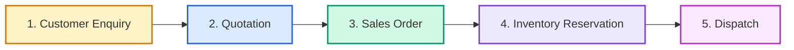
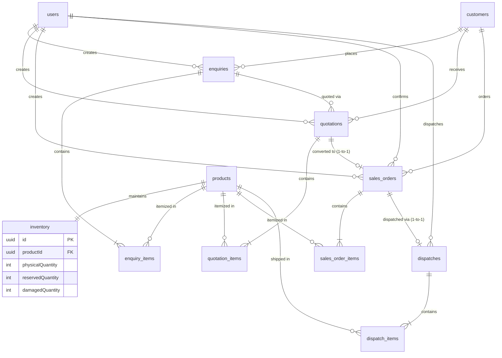

# Industrial Supply ERP System — Technical Case Study (Round 2)

A production-grade, relational ERP system designed for manufacturing and industrial supply businesses, built using the **PERN stack (PostgreSQL + Express.js + React.js + Node.js)**.

---

## Business Workflow

The application implements the complete industrial supply chain workflow:



1. **Customer Enquiry**: Sales Users record customer inquiries with target delivery dates and multi-product line items.
2. **Commercial Quotation**: Generates itemized pricing with unit prices, tiered discount percentages, and GST tax calculations calculated and validated deterministically on the backend.
3. **Sales Order Conversion**: Only `ACCEPTED` quotations can be converted into Sales Orders. Unique constraints guarantee that one quotation cannot accidentally generate duplicate sales orders.
4. **Inventory Reservation**: When an Admin confirms the Sales Order, the system checks stock availability and places an atomic reservation. **Physical inventory does not decrease during reservation.**
5. **Stock Dispatch**: Admin assigns a logistics vehicle and authorized driver. Once dispatched, **both Physical Quantity and Reserved Quantity decrease**.

---

## Tech Stack & Architecture

- **Database**: PostgreSQL 18 with relational foreign keys, cascade rules, database-level `CHECK` constraints, and pessimistic row locks (`SELECT ... FOR UPDATE`).
- **Backend**: Node.js v22 + Express.js + TypeScript + Prisma ORM + JWT authentication + bcryptjs + Zod validation + Swagger OpenAPI.
- **Frontend**: React 18 + Vite + TypeScript + Tailwind CSS + Lucide Icons + Axios with automatic bearer token interceptors.
- **Testing**: Jest + Supertest (covering 5 mandatory tests + simultaneous reservation concurrency stress test).
- **DevOps**: Docker Compose for PostgreSQL, Backend, and Frontend + Postman Collection.

---

## Entity Relationship (ER) Diagram



---

## Important Backend Challenge: Solving Race Conditions

### The Scenario (Page 5)
```
Available Inventory = 100
Two requests arrive almost simultaneously:
- User A -> Reserve 80
- User B -> Reserve 50
Total requested = 130 > 100
```

### Technical Solution
To prevent race conditions, the backend uses **PostgreSQL Pessimistic Row-Level Locking (`SELECT ... FOR UPDATE`)** inside an atomic Prisma interactive database transaction:

```typescript
// Inside prisma.$transaction(async (tx) => { ... })
const lockedInventory = await tx.$queryRaw`
  SELECT id, "productId", "physicalQuantity", "reservedQuantity", "damagedQuantity"
  FROM "inventory"
  WHERE "productId" = ${item.productId}
  FOR UPDATE;
`;

const available = lockedInventory[0].physicalQuantity - lockedInventory[0].reservedQuantity - lockedInventory[0].damagedQuantity;

if (available < item.quantity) {
  throw new Error(`Insufficient stock for product. Required: ${item.quantity}, Available: ${available}`);
}

await tx.inventory.update({
  where: { productId: item.productId },
  data: { reservedQuantity: { increment: item.quantity } },
});
```

1. When User A's transaction executes `FOR UPDATE`, PostgreSQL acquires an exclusive row lock on that product's inventory record.
2. User B's transaction is blocked by the database engine until User A's transaction commits or rolls back.
3. User A successfully reserves 80 units; `reservedQuantity` increases from 0 to 80 (`available` drops from 100 to 20).
4. User A's transaction commits and releases the row lock.
5. User B's transaction acquires the lock and immediately reads the updated state (`available = 20`).
6. Because `20 < 50`, User B's transaction aborts with `Insufficient stock` and rolls back.
7. **Database Constraint Safety**: As a second layer of defense, PostgreSQL `CHECK` constraints are enforced at the table schema:
   ```sql
   ALTER TABLE inventory ADD CONSTRAINT check_reserved_limit 
     CHECK ("reservedQuantity" + "damagedQuantity" <= "physicalQuantity");
   ```

---

## Live Verification Round Preparation (Page 11)

### 1. Damaged Stock Management
- In addition to `Physical` and `Reserved`, the database includes `damagedQuantity`.
- Formula:
  $$\text{Available Quantity} = \text{Physical} - \text{Reserved} - \text{Damaged}$$
- Admin can adjust physical and damaged quantities via the UI or `PATCH /api/inventory/:id`.

### 2. Confirmed Sales Order Cancellation
- The system supports cancelling confirmed orders via `POST /api/sales-orders/:id/cancel`.
- When an Admin or Sales User cancels a `CONFIRMED` sales order, an interactive database transaction with row locks automatically releases the reserved stock (`reservedQuantity = reservedQuantity - item.quantity`) back to available inventory.

---

## Test Login Credentials & Role Permissions

| Role | Email | Password | Allowed Capabilities |
| :--- | :--- | :--- | :--- |
| **ADMIN** | `admin@erp.com` | `admin123` | View all records, manage inventory, confirm sales orders (triggers reservation), process dispatches |
| **SALES** | `sales@erp.com` | `sales123` | Create customers/enquiries, create quotations, convert accepted quotations to sales orders, view inventory |

---

## Setup & Running the Application

### Option A: Local Development

#### 1. Prerequisites
- Node.js (v18+)
- PostgreSQL (v14+) running locally on port 5432 (default user: `postgres`, password: `root`)

#### 2. Backend Setup
```bash
cd backend
npm install

# Setup environment
cp .env.example .env

# Push schema and apply database check constraints
npx prisma db push
npx ts-node prisma/seed.ts

# Start backend server (runs on http://localhost:5000)
npm run dev
```

#### 3. Frontend Setup
```bash
cd ../frontend
npm install

# Start Vite development server (runs on http://localhost:5173)
npm run dev
```

---

### Option B: Docker Compose (One-Click Setup)

```bash
docker-compose up --build
```
- Frontend: `http://localhost`
- Backend API: `http://localhost:5000/api`
- Swagger Docs: `http://localhost:5000/api-docs`

---

## Running Automated Tests

All 5 mandatory case study tests plus the bonus concurrency race-condition test are implemented in Jest + Supertest:

```bash
cd backend
npm test
```

### Test Results
```
PASS src/tests/erp-workflow.test.ts
  Full-Stack ERP Workflow & Business Logic Tests
    ✓ Test 1: Quotation total is calculated correctly by the backend (713 ms)
    ✓ Test 2: Rejected/Draft quotation cannot create a Sales Order (119 ms)
    ✓ Test 3: Same quotation cannot generate duplicate Sales Orders (110 ms)
    ✓ Test 4: Cannot reserve more than available inventory (175 ms)
    ✓ Test 5: Unauthorized user cannot perform a restricted operation (48 ms)
    ✓ Bonus Test: Simultaneous inventory reservations with concurrency row locking (138 ms)

Test Suites: 1 passed, 1 total
Tests:       6 passed, 6 total
```

---

## API Documentation

- **Interactive Swagger UI**: `http://localhost:5000/api-docs`
- **Postman Collection**: `postman_collection.json` (importable into Postman with pre-configured token capture scripts and requests).

### Primary REST Endpoints
- `POST /api/auth/login` — Authenticate and receive JWT
- `GET  /api/auth/me` — Current user profile
- `GET  /api/products` — List products with available stock
- `GET  /api/inventory` — Inventory balance ledger
- `PATCH /api/inventory/:id` — Update stock or report damaged units (Admin)
- `GET  /api/enquiries` — List enquiries
- `POST /api/enquiries` — Create multi-product enquiry
- `PATCH /api/enquiries/:id/status` — Update status (NEW, QUOTED, WON, LOST)
- `GET  /api/quotations` — List quotations
- `POST /api/quotations` — Create quotation with backend calculation
- `PATCH /api/quotations/:id/status` — Update status (DRAFT, SENT, ACCEPTED, REJECTED)
- `POST /api/quotations/:id/convert` — Convert accepted quotation to Sales Order
- `GET  /api/sales-orders` — List sales orders
- `POST /api/sales-orders/:id/confirm` — Confirm order and reserve stock (Admin, row locking)
- `POST /api/sales-orders/:id/dispatch` — Dispatch order with vehicle and driver (Admin)
- `POST /api/sales-orders/:id/cancel` — Cancel order and release reserved stock
- `GET  /api/dispatches` — List all dispatch records
