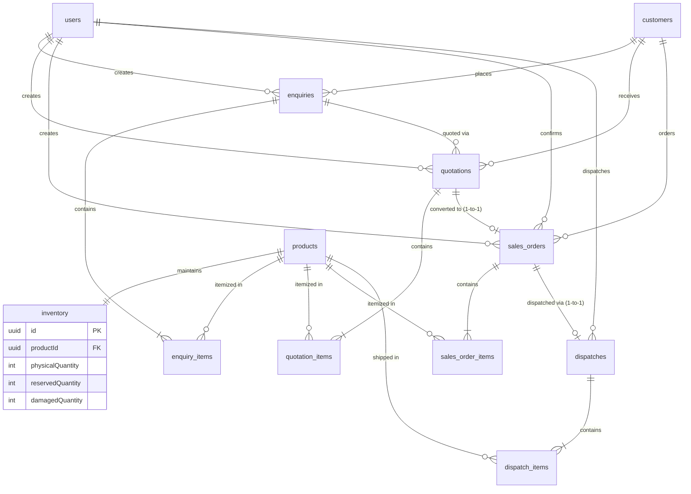

# Round 2 Technical Case Study — Full Implementation Report
**Industrial Supply ERP System (PERN Stack)**

---

## 1. Project Overview & Business Scenario

A manufacturing and supply company sells industrial products to business customers. This project implements the end-to-end commercial supply chain workflow:

$$\mathbf{Customer\ Enquiry} \longrightarrow \mathbf{Quotation} \longrightarrow \mathbf{Sales\ Order} \longrightarrow \mathbf{Inventory\ Reservation} \longrightarrow \mathbf{Dispatch}$$

The application was built from scratch inside `round 2/` using the **PERN stack (PostgreSQL + Express.js + React.js + Node.js)** with **TypeScript**, **Prisma ORM**, and **Tailwind CSS**.

---

## 2. Authentication & Role-Based Access Control (RBAC)

Authentication is implemented using stateless **JSON Web Tokens (JWT)** and **bcryptjs** password hashing with strict backend authorization middleware (`requireRole`). Frontend restrictions are mirrored and enforced on all protected APIs.

| Role | Permissions & Responsibilities | Demo Credentials |
| :--- | :--- | :--- |
| **ADMIN** | • View all ERP ledger records<br>• Manage inventory balances & report damaged stock<br>• Confirm Sales Orders (triggers inventory reservation)<br>• Process order dispatches with vehicle & driver assignment | **Email:** `admin@erp.com`<br>**Password:** `admin123` |
| **SALES** | • Create customers and customer enquiries<br>• Create commercial quotations with discounts & GST<br>• Convert accepted quotations into Sales Orders<br>• Look up real-time inventory availability | **Email:** `sales@erp.com`<br>**Password:** `sales123` |

---

## 3. Database Architecture & Relational Design

A PostgreSQL database (`erp_round2`) was modeled using Prisma ORM with foreign key integrity and database engine constraints:



### Relational Safeguards
1. **Duplicate Prevention via Unique Relations**:
   - `quotations.id` has a `1-to-1` unique relationship with `sales_orders.quotationId`, making it impossible to convert the same quotation into multiple sales orders.
   - `sales_orders.id` has a `1-to-1` unique relationship with `dispatches.salesOrderId`, preventing duplicate dispatches of the same order.
2. **PostgreSQL Check Constraints** (`prisma/constraints.sql`):
   ```sql
   ALTER TABLE inventory 
     ADD CONSTRAINT check_physical_non_neg CHECK ("physicalQuantity" >= 0),
     ADD CONSTRAINT check_reserved_non_neg CHECK ("reservedQuantity" >= 0),
     ADD CONSTRAINT check_damaged_non_neg CHECK ("damagedQuantity" >= 0),
     ADD CONSTRAINT check_reserved_limit CHECK ("reservedQuantity" + "damagedQuantity" <= "physicalQuantity");
   ```

### Seeded Industrial Product Master (6 Products)
1. `PRD-001` — Heavy Duty Hydraulic Pump 500 Bar (Hydraulics, Unit: PCS, Base: ₹18,500, Stock: 100)
2. `PRD-002` — Industrial Electric Motor 5HP 3-Phase (Electrical Machinery, Unit: NOS, Base: ₹12,800, Stock: 150)
3. `PRD-003` — Stainless Steel Ball Valve 2-inch ANSI 150 (Piping & Valves, Unit: PCS, Base: ₹2,450, Stock: 300)
4. `PRD-004` — Pneumatic Air Cylinder 50mm Bore 200mm Stroke (Pneumatics, Unit: PCS, Base: ₹4,200, Stock: 80)
5. `PRD-005` — High Pressure Reinforced Hydraulic Hose 10m (Hoses & Fittings, Unit: MTR, Base: ₹1,650, Stock: 250)
6. `PRD-006` — Precision Helical Gearbox 20:1 Ratio (Mechanical Power, Unit: NOS, Base: ₹24,000, Stock: 50)

---

## 4. End-to-End Workflow Implementation

### Step 1: Customer Enquiry
- Sales Users register enquiries containing target required dates, customer reference, and multiple product line items.
- Auto-generates unique sequence number (e.g. `ENQ-2026-0001`).
- Status progression: `NEW` $\rightarrow$ `QUOTED` $\rightarrow$ `WON` / `LOST`.

### Step 2: Commercial Quotation & Backend Pricing Engine
- Generates itemized quotation against an enquiry.
- **Strict Backend Price Calculation (`CalculationService`)**:
  $$\text{Base Amount} = \text{Quantity} \times \text{Unit Price}$$
  $$\text{Discount Amount} = \text{Base Amount} \times \left(\frac{\text{Discount } \%}{100}\right)$$
  $$\text{Taxable Amount} = \text{Base Amount} - \text{Discount Amount}$$
  $$\text{GST Amount} = \text{Taxable Amount} \times \left(\frac{\text{GST } \%}{100}\right)$$
  $$\text{Line Amount} = \text{Taxable Amount} + \text{GST Amount}$$
  $$\text{Grand Total} = \sum \text{Line Amount}$$
- Overrides or validates all numbers on the backend; never blindly trusts frontend payload.
- Status progression: `DRAFT` $\rightarrow$ `SENT` $\rightarrow$ `ACCEPTED` / `REJECTED`.

### Step 3: Quotation $\rightarrow$ Sales Order Conversion
- Only `ACCEPTED` quotations can be converted.
- Requests with `DRAFT` or `REJECTED` status are rejected with HTTP 400.
- Duplicate conversions are blocked with HTTP 409.
- Order is initialized in `PENDING` status.
- Associated enquiry status is automatically updated to `WON`.

### Step 4: Inventory Reservation (Solving the Concurrency Challenge)
- When an Admin confirms the Sales Order (`POST /api/sales-orders/:id/confirm`):
  - Queries inventory rows using **PostgreSQL Pessimistic Row-Level Locking** (`SELECT ... FOR UPDATE`) within an atomic transaction.
  - Verifies:
    $$\text{Available Stock} = \text{Physical} - \text{Reserved} - \text{Damaged} \ge \text{Order Quantity}$$
  - If sufficient, increments `reservedQuantity` by the order quantity.
  - **Physical inventory does not decrease during reservation.**
- **Concurrency Protection**:
  If User A attempts to reserve 80 units and User B attempts to reserve 50 units simultaneously when available inventory is 100, PostgreSQL serializes access on the locked row. User A completes first (leaving available = 20); User B's transaction acquires the lock, observes $20 < 50$, and is safely aborted with an `Insufficient stock` error.

### Step 5: Stock Dispatch
- Admin triggers dispatch (`POST /api/sales-orders/:id/dispatch`) with vehicle number and driver name.
- Sales Order must be in `CONFIRMED` status.
- In an atomic transaction:
  - **Physical Quantity decreases** by dispatched quantity.
  - **Reserved Quantity decreases** by dispatched quantity.
  - Available stock remains consistent.
  - Order status is updated to `DISPATCHED`.

---

## 5. Live Verification Features (Case Study Page 11)

1. **Damaged Stock Accounting**:
   - Maintains `damagedQuantity` in the inventory table.
   - Formula:
     $$\text{Available Quantity} = \text{Physical} - \text{Reserved} - \text{Damaged}$$
   - Example verified: Physical = 100, Reserved = 20, Damaged = 10 $\implies$ Available = 70.
   - Admin can adjust physical/damaged stock via `PATCH /api/inventory/:id`.
2. **Confirmed Sales Order Cancellation**:
   - Allows cancellation of confirmed orders (`POST /api/sales-orders/:id/cancel`).
   - Transaction locks inventory rows and releases the reserved quantity (`reservedQuantity -= item.quantity`), returning stock to available inventory.

---

## 6. Automated Testing Suite

All 5 mandatory tests plus the simultaneous reservation concurrency stress test were implemented using **Jest** and **Supertest** (`backend/src/tests/erp-workflow.test.ts`):

```bash
cd backend
npm test
```

### Test Results
```
PASS src/tests/erp-workflow.test.ts
  Full-Stack ERP Workflow & Business Logic Tests
    ✓ Test 1: Quotation total is calculated correctly by the backend (713 ms)
    ✓ Test 2: Rejected/Draft quotation cannot create a Sales Order (119 ms)
    ✓ Test 3: Same quotation cannot generate duplicate Sales Orders (110 ms)
    ✓ Test 4: Cannot reserve more than available inventory (175 ms)
    ✓ Test 5: Unauthorized user cannot perform a restricted operation (48 ms)
    ✓ Bonus Test: Simultaneous inventory reservations with concurrency row locking (138 ms)

Test Suites: 1 passed, 1 total
Tests:       6 passed, 6 total
Snapshots:   0 total
Time:        20.918 s
```

---

## 7. Frontend User Interface (4 Main Screens)

Built with **React 18**, **Vite**, and **Tailwind CSS**:

1. **Screen 1: Login** (`/login`):
   - Fast demo persona switcher: **Demo Admin** and **Demo Sales User** buttons.
   - Visual role matrix showing permissions for each role.
2. **Screen 2: Enquiries** (`/enquiries`):
   - Interactive table with status badges and search/filter controls.
   - Multi-product dynamic builder modal with live customer creation.
   - 1-click shortcut to generate quotation from an enquiry.
3. **Screen 3: Quotations** (`/quotations`):
   - Line item pricing configuration (unit price, discount %, GST %).
   - Live pricing calculation breakdown (Base, Discount, GST, Grand Total).
   - Accept / Reject action buttons and 1-click conversion to Sales Order.
4. **Screen 4: Sales Orders & Stock Reservation** (`/sales-orders`):
   - Real-Time Inventory Ledger panel with color-coded stock health indicators (In Stock, Low Stock, Out of Stock) and Admin stock adjustment modal.
   - Admin "Confirm Order" button (triggers row-locking reservation).
   - Admin "Dispatch Order" modal with vehicle number and driver name.
   - "Cancel Order" button with automatic reservation release.
   - End-to-end traceability breadcrumb: `Customer → Enquiry → Quotation → Sales Order → Dispatch`.

---

## 8. API Documentation & Deliverables

- **Swagger OpenAPI Docs**: Available live at `http://localhost:5000/api-docs`.
- **Postman Collection**: `round 2/postman_collection.json` containing pre-configured requests with automated bearer token assignment.
- **Docker Compose**: `round 2/docker-compose.yml` for multi-container deployment (`docker-compose up --build`).
- **Git Repository**: Pushed to `https://github.com/yogesh0526/fundsroom-erp-crm.git` on branch `main` across 5 structured commits:
  - `ec8d175`: `chore: archive round1 submission into round1 directory`
  - `fbec3f8`: `feat(backend): implement REST APIs, PostgreSQL row-locking reservation, and 6 automated tests`
  - `9eea931`: `feat(frontend): build 4 responsive screens - Login, Enquiries, Quotations, and Sales Orders with stock reservation and dispatch`
  - `7646812`: `docs: add comprehensive README with architecture, ER diagram, concurrency analysis, Postman collection, and Docker Compose`
  - `264da59`: `fix(test): automatically restore demo seed in afterAll so test runs do not alter UI credentials`
